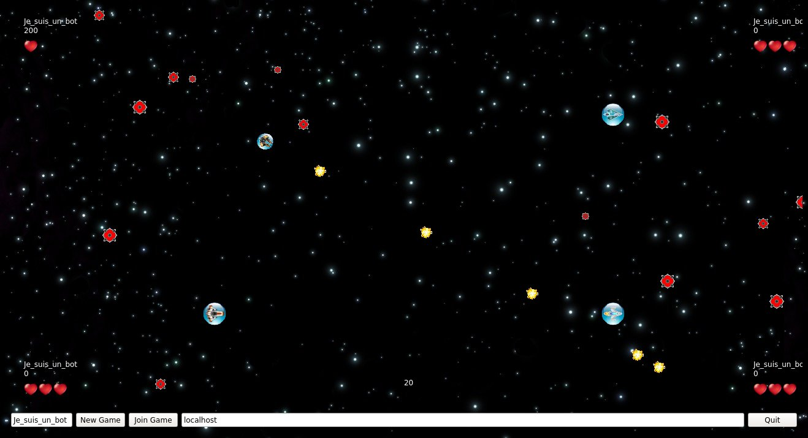

# Multistorm

Multistorm is a revisited version of the game [Minestorm](https://www.wikiwand.com/en/Mine_Storm) built into the Vectrex game system.

You can play with 4 players maximum, thanks to multiplayer mode :-)

This program is realised in C++11 with QT 5.5.

## How to

  - First you have to install dependencies : ```apt-get install make g++ qt5-default qtmultimedia5-dev```
  - Compile : ```qmake -makefile && make```
  - Launch a server : ```./multistorm srv```
  - Launch a client : ```./multistorm cli```
  - Enter host address and click ```Join game```
  - Use ```arrow key``` to move, ```space``` to shoot and ```escape``` to quit

## Features

  - Random mines direction
  - Shot limitation
  - Circular map
  - Inertial movement
  - 4 players max
  - Spectator mode
  - Nice graphics and sound
  - Choose nickname and join a game server
  - Score and lives
  - Mines repop

## Screenshot


